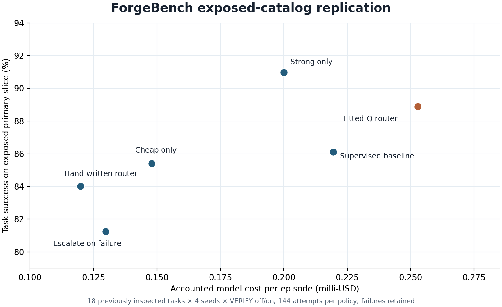

# Exposed-catalog replication and VERIFY ablation

**Completed September 25, 2026 UTC.** The [protocol](../../../docs/forgebench/EXPOSED_REPLICATION_PROTOCOL.md) and [freeze](freeze.json) were fixed before inference, with source commit `ddc5590` and freeze SHA-256 `a180c4c81079a017c50323ae72d14fa122a2a0ad9805b6dc7c8862b1ad8aba34`. This study repeats the **27 previously inspected v0.3 tasks**, not a fresh holdout or a new upstream-issue benchmark. Historical train-only controllers and model weights were unchanged.

Six fixed policies each ran on every task at seeds 31, 47, 73 and 101, with shared supplemental VERIFY enabled and disabled in paired conditions: **1,296 recorded episodes, no missing design cells**. Of these, 1,292 ended normally and four ended in model-provider errors (three HTTP 502, one HTTP 429). Provider failures remain in every attempt and success denominator. All 1,296 runs have event trajectories, totaling 22,451 records across prompts, model calls, decisions, tool calls, patches, tests, errors, retries and final outcomes.

The primary slice contains 18 already exposed authored tasks across six families. Each policy has 144 attempts (18 tasks × 4 seeds × VERIFY off/on):

| Policy | Solved / attempted | Accounted model cost, total | Mean cost / episode | Median elapsed time |
|---|---:|---:|---:|---:|
| Strong model only | 131/144 | $0.028803 | $0.000200 | 15.74 s |
| Fitted-Q adaptive router | 128/144 | $0.036398 | $0.000253 | 16.14 s |
| Supervised observed-return baseline | 124/144 | $0.031611 | $0.000220 | 16.15 s |
| Cheap model only | 123/144 | $0.021297 | $0.000148 | 5.47 s |
| Hand-written router | 121/144 | $0.017272 | $0.000120 | 5.50 s |
| Escalate on failure | 117/144 | $0.018696 | $0.000130 | 5.37 s |

**The adaptive router did not achieve the hoped-for cost-quality tradeoff here.** On this exposed primary slice, strong-only solved three more attempts at lower total accounted model cost, and it also had slightly lower median elapsed time. This is a descriptive result for this fixed run, not proof that one policy is generally superior. The learned controller made 156 learned decisions with two fallbacks in the primary slice; it was not refitted on these outcomes.

The primary comparison gives each of six related task families equal weight; each family contributes exactly three variants per seed, so this weighting equals the attempt average in the table. The [family-by-seed paired outcomes](analysis/family-paired.csv) retain every VERIFY difference, including reversals. Across the four requested seeds, adaptive solved 30–34 of 36 primary attempts per seed and strong-only solved 32–34 of 36; the [seed table](analysis/seed-summary.csv) gives all six policy ranges. These are repeat trajectories on the same tasks, not independent task families.

The paired VERIFY comparison also lacks a broad positive result. Across 432 primary policy/task/seed pairs, VERIFY-off and VERIFY-on each solved **372/432**. Turning VERIFY on gained success in 21 pairs and lost it in 21. The per-policy changes ranged from +3/72 for cheap-only to -4/72 for the supervised baseline; the [paired table](analysis/verify-effect.csv) retains all directions and costs. VERIFY consumes actual decisions, calls and wall time under the same episode ceilings; the measured resource use was not forced equal. Provider failures and stochastic outputs remain part of the observed differences.

The primary trajectories record **446 supplemental verification calls** over 233.2 seconds. Supplemental checks caught 18 visible-candidate failures across 16 episodes; five of those episodes ended solved. In 58 primary VERIFY-on records, the supplemental checker still reported green while final hidden grading failed (`missed_failure`). Thus a successful supplemental check is not a reliable substitute for the held-out grader in this catalog.

The six exposed validation tasks account for 288 episodes, 283 solved; the three separately licensed source-derived tasks account for 144 episodes, 143 solved. These cohorts are retained in the [policy summary](analysis/policy-summary.csv) and [per-run derived data](analysis/cells.csv). They are **not pooled into the primary table** and do not establish transfer to unseen projects. In the primary slice, executed final hidden checks passed 4,331/4,464 individual test assertions; this is a test-level fraction among graded attempts, **not** task success or coverage of provider-failed attempts. The same slice recorded 3,089 tool calls, 67 success-after-repair outcomes, and 555 unnecessary-edit proxy counts. Of all 1,296 run records, 1,252 had complete token accounting; 44 retained an incomplete-token flag, so no exact all-run token total is asserted. Failure labels are non-exclusive and remain in [machine-readable summary](analysis/summary.json).

The sum of recorded per-run charges is **$0.257867**. The durable research ledger moved from $2.737447 to $2.995314, exactly the same delta; its public-trial bucket stayed at $0.067350. The per-event reported-cost subset totals $0.194851, with another $0.063016 retained as conservative uncertainty reservations. This is model-use accounting, not an account invoice, and excludes credit purchase fees. The frozen study cap was $3; no cap increase, replacement run, or outcome-selected rerun occurred.

The private complete trajectory archive has SHA-256 `424c653b77ab98699def27612f53cdd909595281ba07a94138b87c3` and remains outside the public repository pending a separate release/privacy review. Public derived CSV/JSON contain task IDs, statuses and numeric metrics only; they contain no prompts, patches, model output, credentials or private applicant data. The [offline analyzer](../../../scripts/analyze_exposed_replication.py) checks the frozen design, one result per cell, event coverage, raw-index consistency and ledger reconciliation before writing those derived files. Reproducing the full aggregation requires access to that private archive and its sanitized ledger receipt; the public CSV supports recalculation of the displayed tables and figure without model calls.

This experiment is a replication/ablation over **related miniature tasks already seen during development**. Four seeds are repeated trajectories on the same catalog, not independent issue families. Provider endpoint/quantization were pinned to CoreWeave FP4, but the provider does not expose a fixed checkpoint revision and requested seed values do not guarantee deterministic responses. Further claims about generalization or a learned routing advantage require genuinely new, provenance-reviewed task families and another prospective freeze.
