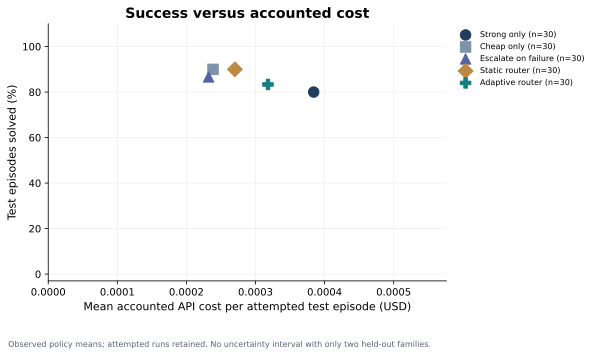
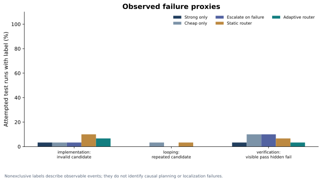
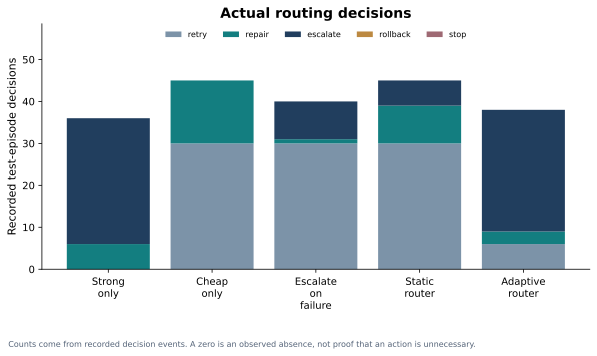
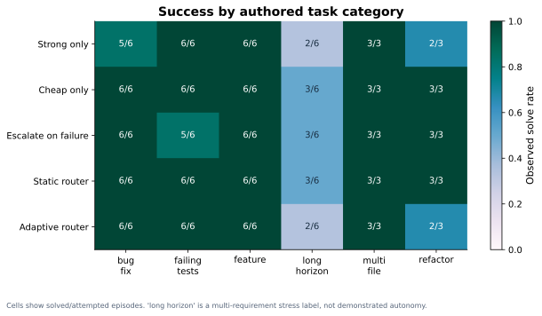

# Adaptive routing for bounded coding agents

## ForgeBench v0.2 technical report

Stelios Zacharioudakis  |  Research software artifact; not peer reviewed or submitted as a preprint.

Evidence generated: 2026-09-23T23:26:33.325366+00:00  |  Coverage status: **complete**

## Abstract

ForgeBench v0.2 studies observable-state routing for bounded coding repair agents on 50 authored miniature Python tasks. This artifact contains 300/300 planned evaluation episodes and 180/180 training episodes; status: complete. The test summary covers 150 episodes on 10 observed tasks from 2 families. Five policies share the same execution and stopping contract. Full prompts, visible responses, edits and test trajectories are retained. Adaptive routing solved 25/30 test episodes (83.3%), compared with 24/30 (80.0%) for strong-only. Mean accounted API cost per attempted episode was $0.000318 for adaptive and $0.000384 for strong-only. These are descriptive observations on this authored suite; they do not establish broad model or router superiority.

## Motivation and related work

Routing can trade model-call expense against solution quality. RouteLLM studies learned model selection using preference data [2]; FrugalGPT studies learned cascades [3]. SWE-bench evaluates real GitHub issue resolution [1]. ForgeBench is a small, transparent engineering research platform for repeated multi-file repair decisions; it is not a SWE-bench result, a replication of those methods, or evidence of research novelty by itself.

## Benchmark and split

The catalog contains ten domain families with five related variants each. The fixed split is 30 training, 10 validation and 10 test tasks with disjoint families. Tasks cover bug fixes, linked-module changes, features, refactoring, failing tests and integrated multi-requirement stress cases. Implementation and task construction used AI-assisted development. Every task has a visible reproduction, explicit success criterion, hidden checks and a reference implementation, validated in the isolated executor. Hidden tests are withheld from the agent during episodes; the reproducible repository publishes the test definitions. This does not provide a private, contamination-resistant holdout. Related variants share interfaces and cannot be treated as fully independent repositories.

## Method and baselines

The harness supplies flat Python modules and visible test feedback to hosted language models. Routing actions are retry, repair, escalate, rollback and stop. The five policies are strong-only, cheap-only, cheap-to-strong after visible failure, a hand-written router and an offline fitted-Q router. Learned observations contain visible outcomes and budget/attempt state, never task identity, hidden results or reference patches. A train-only artifact is frozen before validation/test; unseen state/action support uses an explicitly labeled static fallback. Hosted language-model weights are unchanged. The adaptive test traces contain 35 learned decisions and 3 fallback decisions. Observed evaluation model IDs: openai/gpt-oss-20b, openai/gpt-oss-120b.

## Execution and experiment controls

Candidate code executes only inside a disposable networkless, read-only, non-root container with resource and output bounds; expected answers remain in the trusted host grader. Policies share at most six model calls, ten routing decisions, an equal output token ceiling and a 100,000-token episode budget; explicit retry and invalid-response retry limits bound loops. Public-test success ends routing; hidden grading runs once after all decisions. Seeds 17, 29 and 43 are predeclared independent hosted sampling requests, not guaranteed deterministic samples. A separate train-only controller is fitted per seed. Validation is reported without parameter selection. Failed and missing episodes remain in the artifacts, and the public demo only reads recorded evidence.

## Metrics and results

Adaptive routing solved 25/30 test episodes (83.3%), compared with 24/30 (80.0%) for strong-only. Mean accounted API cost per attempted episode was $0.000318 for adaptive and $0.000384 for strong-only. These are descriptive observations on this authored suite; they do not establish broad model or router superiority. Task success requires all visible and hidden checks with completed grading. Success rates divide solved by attempted episodes, including failed provider or execution attempts. Hidden-test pass rates describe graded hidden cases and show graded coverage. Token counts remain unknown when accounting is unavailable. Cost basis: OpenRouter reported usage.cost; uncertain requests retain price-ceiling reservation. Credit purchase fees excluded.. Latency includes network, hosted inference and sandbox work, not GPU-seconds. The cost-quality plot displays observed policy means; no Pareto superiority is implied for incomplete or unmatched coverage.

| Policy | Solved / attempted | Success | Mean cost (USD) | Mean tokens | Mean latency (s) |
| --- | ---: | ---: | ---: | ---: | ---: |
| Strong only | 24/30 | 80.0% | 0.000384 | 2433.4 | 24.6 |
| Cheap only | 27/30 | 90.0% | 0.000239 | 3325.1 | 12.9 |
| Escalate on failure | 26/30 | 86.7% | 0.000232 | 2685.3 | 15.3 |
| Static router | 27/30 | 90.0% | 0.000270 | 3055.5 | 16.5 |
| Adaptive router | 25/30 | 83.3% | 0.000318 | 2466.7 | 28.3 |

## Failure analysis and action use

Failure labels describe observable events: invalid candidate, rejected execution, visible regression, repeated identical candidate, or visible-pass/hidden-fail. Labels can co-occur. Localization, planning and context-loss causes require additional annotation and are not inferred from these proxies. Regressions count previously passing visible checks made failing. Success-after-repair uses runs with more than one model attempt as its denominator. Escalation frequency counts cheap-to-strong switches, not starting strong. Unnecessary edits is a post-decision reference-scope proxy: changed files outside the supplied reference patch's file set. Alternative valid solutions may count. Tool calls count harness-orchestrated sandbox checks; the model does not independently operate a shell.

## Uncertainty, ablations and limitations

The observed test set has 2 held-out families. Seeds are averaged within tasks and related tasks are grouped by family for paired comparisons. With fewer than three families, no family-bootstrap interval is estimated. Repeated seeds do not increase the number of independent families. The baseline comparisons separate policy behavior, but causal ablations of rollback, repair instructions, budget features and reward weights have not been run and are not claimed. The long_horizon category is an authored multi-requirement stress category, not demonstrated long-horizon autonomy. Small repositories, transparent test definitions, sparse learned-state support, possible pretraining contamination, provider nondeterminism and limited external validity constrain conclusions.

## Reproducibility and next experiments

The release includes versioned task definitions, an execution contract, frozen controllers, per-event trajectories, source/provenance hashes, results.csv, failure_analysis.csv and bootstrap_results.json. The CLI plans by default and paid research requires explicit execution with the existing durable ledger. Original study artifacts are not overwritten. Next work should add genuinely distinct families, preregister causal ablations, audit failure labels manually, and evaluate real repository issues before making broader generalization or long-horizon claims. New model runs must preserve provider, price and configuration provenance.

## Figures

Observed policy means; attempted runs retained. No uncertainty interval with only two held-out families.

Nonexclusive labels describe observable events; they do not identify causal planning or localization failures.

Counts come from recorded decision events. A zero is an observed absence, not proof that an action is unnecessary.

Cells show solved/attempted episodes. 'long horizon' is a multi-requirement stress label, not demonstrated autonomy.

## References

1. [Jimenez et al. SWE-bench: Can Language Models Resolve Real-World GitHub Issues?](https://arxiv.org/abs/2310.06770)
2. [Ong et al. RouteLLM: Learning to Route LLMs with Preference Data.](https://arxiv.org/abs/2406.18665)
3. [Chen, Zaharia and Zou. FrugalGPT: How to Use Large Language Models While Reducing Cost and Improving Performance.](https://arxiv.org/abs/2305.05176)
