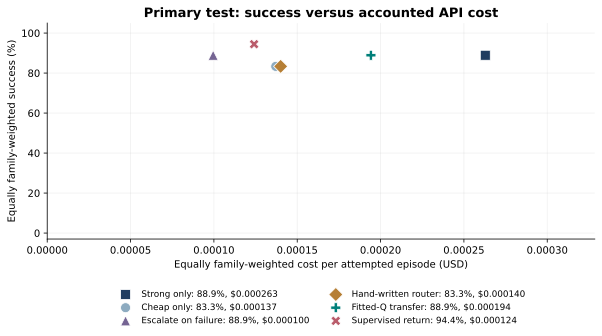
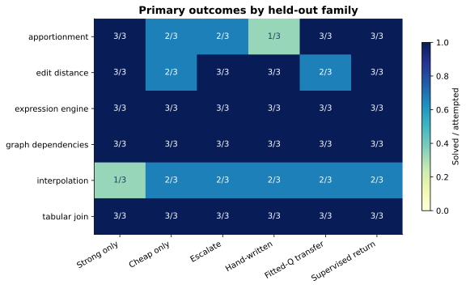
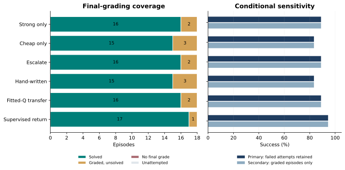
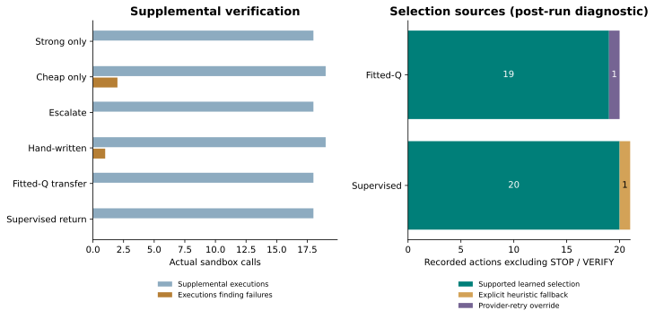

# ForgeBench v0.3 prospective transfer pilot

Stelios Zacharioudakis

Technical research artifact; not peer reviewed or submitted as a preprint.

## Scope

This prospective transfer pilot recorded 162/162 prespecified episodes; status: complete. Primary test evidence covers 108/108 planned episodes across six fresh authored families and three related tasks per family. Six validation tasks and three source-derived tasks are reported separately. The prior 50 tasks / ten families were already inspected and remain development material, never fresh holdouts.

## Method

Six policies share original-visible tests, at most two supplemental verifications, and final-only hidden grading. Historical completed training transitions from the original 30 train tasks fit two frozen observational selectors: tabular fitted-Q and a simpler mean discounted-return regressor. Unobserved actions have no fabricated labels; unseen states/actions use a recorded heuristic fallback. Historical VERIFY support is zero, so every policy shares an explicit verify-on-visible-green rule. This experiment does not learn verification or update language-model weights.

## Primary observations

Fitted-Q transfer recorded 88.9% success at $0.000194 accounted API cost/task. Supervised return recorded 94.4% success at $0.000124 accounted API cost/task. Strong only recorded 88.9% success at $0.000263 accounted API cost/task. Cheap only recorded 83.3% success at $0.000137 accounted API cost/task. These observations do not establish broad superiority, statistical significance, or a deployment recommendation.

### test

| Policy | Attempted/planned | Family-weighted success | Accounted cost/task | Graded-only success | Graded n |
| --- | ---: | ---: | ---: | ---: | ---: |
| Strong only | 18/18 | 88.9% | $0.000263 | 88.9% | 18 |
| Cheap only | 18/18 | 83.3% | $0.000137 | 83.3% | 18 |
| Escalate on failure | 18/18 | 88.9% | $0.000100 | 88.9% | 18 |
| Hand-written router | 18/18 | 83.3% | $0.000140 | 83.3% | 18 |
| Fitted-Q transfer | 18/18 | 88.9% | $0.000194 | 88.9% | 18 |
| Supervised return | 18/18 | 94.4% | $0.000124 | 94.4% | 18 |

### validation

| Policy | Attempted/planned | Family-weighted success | Accounted cost/task | Graded-only success | Graded n |
| --- | ---: | ---: | ---: | ---: | ---: |
| Strong only | 6/6 | 100.0% | $0.000142 | 100.0% | 6 |
| Cheap only | 6/6 | 83.3% | $0.000205 | 83.3% | 6 |
| Escalate on failure | 6/6 | 100.0% | $0.000128 | 100.0% | 6 |
| Hand-written router | 6/6 | 100.0% | $0.000181 | 100.0% | 6 |
| Fitted-Q transfer | 6/6 | 100.0% | $0.000138 | 100.0% | 6 |
| Supervised return | 6/6 | 100.0% | $0.000145 | 100.0% | 6 |

### external

| Policy | Attempted/planned | Family-weighted success | Accounted cost/task | Graded-only success | Graded n |
| --- | ---: | ---: | ---: | ---: | ---: |
| Strong only | 3/3 | 100.0% | $0.000852 | 100.0% | 3 |
| Cheap only | 3/3 | 100.0% | $0.000309 | 100.0% | 3 |
| Escalate on failure | 3/3 | 100.0% | $0.000444 | 100.0% | 3 |
| Hand-written router | 3/3 | 100.0% | $0.000400 | 100.0% | 3 |
| Fitted-Q transfer | 3/3 | 100.0% | $0.000323 | 100.0% | 3 |
| Supervised return | 3/3 | 100.0% | $0.000266 | 100.0% | 3 |

## Infrastructure and costs

Among attempted primary test episodes, 0 lack a final grade. They remain unsolved in the primary attempted denominator. The graded-only view is explicitly secondary and conditional on successful infrastructure. Unattempted matrix cells remain missing. Accounted cost includes conservative retained reserves when a provider charge cannot be confirmed; it excludes credit-purchase fees, VPS costs, local CPU monetary estimates and GPU expenses. The shared-ledger pilot delta was $0.030646 against the frozen $1 total cap.

## Verification and support

Within the primary test split, supplemental calls found 3 failing visible-green candidates; 0 episodes later succeeded after an observed supplemental failure. The final candidate comparison records 12 missed failures (supplemental pass, final failure) and 0 false rejections (supplemental failure, final success). Missing either measurement yields null disagreement. These correlated author-written checks are not an independent oracle, and observed repair after verification does not identify a causal benefit without a matched no-VERIFY ablation.

## Selection-coverage clarification

Primary-test post-run diagnostic, added after inspecting the recorded source labels; it does not alter primary scores, the frozen runtime or the preregistered all-action counts. Fitted-Q transfer retains 19 learned and 0 fallback events in the original all-action totals. Excluding STOP/VERIFY leaves 19 learned, 0 heuristic and 1 provider-retry actions (20 total). Its 18 STOP events include 18 constraint and 0 fallback labels. Supervised return retains 20 learned and 19 fallback events in the original all-action totals. Excluding STOP/VERIFY leaves 20 learned, 1 heuristic and 0 provider-retry actions (21 total). Its 18 STOP events include 0 constraint and 18 fallback labels. The original fallback totals are therefore dominated by a terminal-label asymmetry, not evidence that one selector had proportionally more unsupported routing states. Provider-retry overrides remain a separate source, not learned choices.

## Controls

Requested seed 17; GPT-OSS-20B and GPT-OSS-120B pinned through OpenRouter to CoreWeave/fp4 with no fallback. Both receive max 4,096 output tokens, temperature 0.2, up to six actual provider requests, ten routing decisions and 100,000 bounded tokens per episode. HTTP 429 retries are capped at two and consume the same request/decision budgets. The historical $1 episode cap preserves state-encoding semantics; the independent $1 total pilot cap uses the original durable ledger. Hosted checkpoint revisions are unavailable and requested seeds do not guarantee determinism.

## Source-derived track

Three artificial mutation tasks use actual Boltons clamp/ceil/floor source at immutable revision 4e5faa3d7e4008d89e0d8bf1ea87b6d9a061a16d with original BSD-3-Clause notices. The adapter, faults and checks are newly authored. This is not an upstream issue benchmark, SWE-bench, an upstream endorsement, or evidence of contamination-free generalization. The external family is descriptive only and never pooled with the six authored primary families.

## Limitations

This is one seed, six authored primary families, compact flat Python repositories, correlated variants, AI-assisted task/check construction, and author-correlated supplemental/final grading. Historical behavioral propensities are missing, so no importance-weighted or causal off-policy claim is supported. Inference/provider nondeterminism and selected compatible upstream functions constrain external validity. All comparisons are descriptive; no population confidence interval or significance claim is made. Full v0.3 still requires broader external issues, prospective exploration with logged action probabilities, supported learned VERIFY, matched ablations and more seeds.

## Artifact provenance

Source commit: 7b383887eaa69e970e00060a6fc8c16e6fe73567. Runtime SHA256: 990e82a33d8a69f73cc3690031ff98fa430fc073d5bca035666b39b124769708. Frozen protocol SHA256: ae5156ee716a6babff6ef2871a988988c0917ec4a63b0f18bc22ad41848dd3ae. Catalog SHA256: d5b6c496bbb7c4409361ed48a482ba15f76f2b1be1185d3741778285e3a74504. The report is generated from immutable real run records reconciled against the frozen execution matrix. Source code, controller evidence, full visible trajectories, partial coverage and negative outcomes remain inspectable. This technical artifact is not peer reviewed, published as an academic paper or submitted as a preprint.

Observed means over six authored test families, with three related tasks per family and one requested seed. Failed provider/executor attempts remain unsolved. Points are not jittered; overlapping points are disclosed in the numeric legend. No population confidence intervals, significance test, or general superiority claim.

Cells show solved/attempted episodes, not independent seed replicates. Each family contains three related variants. The two validation families and the source-derived Boltons family are excluded from this primary matrix.

No final grade includes provider/executor failures and bounded stops; these remain in the primary attempted denominator. The graded-only success fraction is a secondary episode-weighted view conditional on infrastructure availability. It does not replace the family-weighted primary metric. Unattempted cells remain missing, never fabricated failures.

All policies share the same verify-on-visible-green rule; VERIFY is not learned. Right panel is a post-run clarification: all STOP and VERIFY actions are excluded, and provider-retry overrides are shown separately. The original all-action learned/fallback counts remain in the data. Forced STOP provenance differs between the two frozen selectors; raw fallback totals are not directly comparable selection coverage. A caught supplemental failure is an observed signal, not evidence of causal benefit or independent grading.

## Source references

- [Boltons source at pinned revision](https://github.com/mahmoud/boltons/blob/4e5faa3d7e4008d89e0d8bf1ea87b6d9a061a16d/boltons/mathutils.py)
- [Retained upstream license](https://github.com/mahmoud/boltons/blob/4e5faa3d7e4008d89e0d8bf1ea87b6d9a061a16d/LICENSE)
- [Frozen protocol and source](https://github.com/stelioszach03/forgerl/tree/7b383887eaa69e970e00060a6fc8c16e6fe73567)
